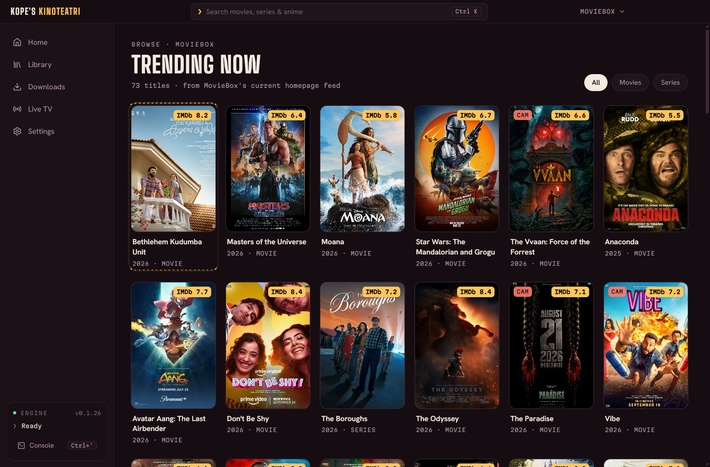
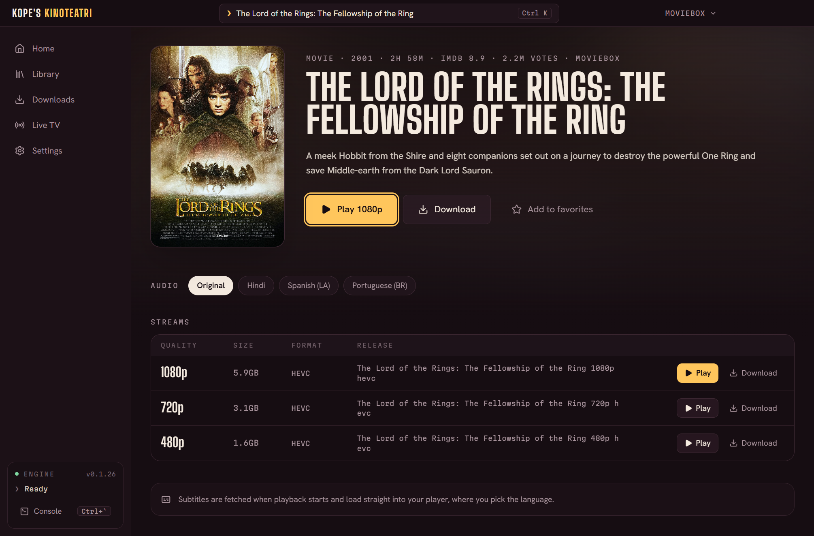
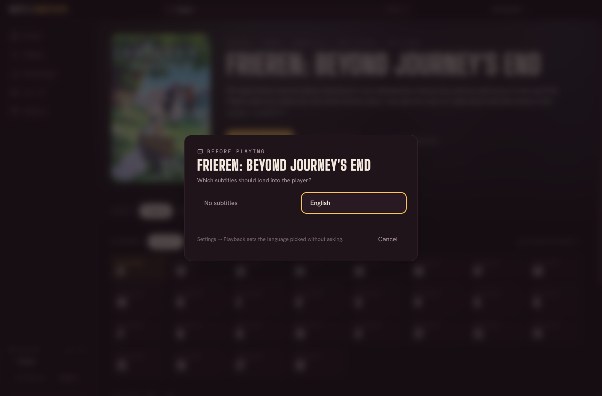

# Kope's Kinoteatri

A desktop app for watching movies, series, anime and Asian dramas. Kope's Kinoteatri gives you:

- search with posters, IMDb ratings and the IMDb top lists;
- audio track, season, episode and quality choice;
- automatic subtitles;
- play in VLC or mpv, or download;
- continue watching, history, favorites and Live TV;
- **ქართული** or English (the **ქარ / ENG** switch in the top bar);
- more sources through Stremio add-ons;
- **watch on your phone**: an iPhone or Android phone on the same Wi-Fi opens the app in its browser.

It is a window onto [**moviebox-tui**](https://github.com/mesamirh/MovieBox-Tui), a free open-source terminal app. Every search, stream lookup, playback and download is done by moviebox-tui. The app runs it in a hidden terminal, types the keys you would, and reads the answers from its screen and cache files.




## Install (Windows 10 and 11)

1. Download **[KopesKinoteatri-Setup.exe](https://github.com/KupeKuperi/kopes-kinoteatri/releases/latest/download/KopesKinoteatri-Setup.exe)** (always the newest version; release notes on the [releases page](https://github.com/KupeKuperi/kopes-kinoteatri/releases/latest)).
2. Run it. It installs for your user only (no admin prompt) and adds Desktop and Start-menu shortcuts. The installer isn't code-signed, so Windows SmartScreen may say *"Windows protected your PC"*: click **More info → Run anyway**.
3. On first start the app checks for what it needs:
   - **moviebox-tui (required).** If it isn't installed, click **Install moviebox-tui**. The app downloads its official GitHub release (a few MB), checks it against the release's SHA-256 checksums, and puts it where moviebox-tui's own installer would: `%LOCALAPPDATA%\Programs\MovieBox-Tui\bin`.
   - **A video player (required to play).** Without VLC or mpv, Home shows **Install VLC**, which uses winget. Windows asks for permission because VLC installs for all users.
   - **yt-dlp (only for MovieBox downloads).** The Downloads page offers **Install yt-dlp** (winget, together with ffmpeg).

To update, install a newer Setup.exe over the old one. To remove the app, use Windows Settings → Apps. Your history, favorites and settings belong to moviebox-tui and stay.

## Install (Mac)

1. Download the disk image for your Mac:
   - **[Apple Silicon (M1 and newer)](https://github.com/KupeKuperi/kopes-kinoteatri/releases/latest/download/KopesKinoteatri-mac-apple-silicon.dmg)**;
   - **[Intel](https://github.com/KupeKuperi/kopes-kinoteatri/releases/latest/download/KopesKinoteatri-mac-intel.dmg)**.

   Not sure which you have? Apple menu → About This Mac: "Chip: Apple M…" means Apple Silicon.
2. Open it and drag **Kope's Kinoteatri** into **Applications**.
3. Start it. The app isn't signed with an Apple Developer ID, so the first time macOS refuses to open it. Open **System Settings → Privacy & Security**, scroll down to *"Kope's Kinoteatri" was blocked…* and click **Open Anyway**. After that it opens normally.
4. As on Windows, the app offers to install what's missing:
   - **moviebox-tui:** its official macOS release, checksum-verified, into `~/.local/bin`, where the engine's own installer puts it. If you prefer Homebrew: `brew tap mesamirh/moviebox-tui https://github.com/mesamirh/MovieBox-Tui && brew install moviebox-tui`.
   - **A player:** IINA, mpv or VLC. The app installs VLC with Homebrew if you have it, otherwise it opens VLC's download page.
   - **yt-dlp:** only for MovieBox downloads.

On a Mac the shortcuts use ⌘: ⌘K searches, ⌘1–⌘5 switch sections.

## Watch on a phone (iPhone or Android)

The app on your computer can serve phones on the same network:

1. On the computer: **Settings → Phone** (ტელეფონი) → turn on **Phone access**. A QR code appears.
2. On the phone: open the camera, point it at the code and tap the link. The app opens in Safari (or Chrome), already paired.
3. On an iPhone, **Share → Add to Home Screen** gives it an icon; it then opens full screen like an app.
4. The first time, Windows asks whether Kope's Kinoteatri may use the network: allow it on **private** networks.

On the phone you search, browse and open titles as on the computer. **Play** plays on the phone; the 🖥 button plays on the computer instead (handy when the computer is connected to a TV). Live TV channels play on the phone too. Watched progress shows up in Continue watching on both.

How it works: the computer still does everything. The engine finds and unlocks the stream exactly as for the computer's player; the app hands what the engine would give VLC to the phone instead, turning MovieBox's DASH streams into HLS playlists (what an iPhone plays) and passing the video through unchanged. So the computer must stay on with the app open, and the phone must be on the same Wi-Fi. With [Tailscale](https://tailscale.com) on both, the phone reaches it from anywhere (the Tailscale address is listed under the QR code). The pairing code is in the QR code; **New pairing code** unpairs every phone.

## What it does

| Screen | |
| --- | --- |
| **Home** | Resume what you watched last, continue watching, the **IMDb top lists** (Top Rated Movies/Series, Best New Movies/Series: IMDb's own ratings with a minimum number of votes), the source's own lists (MovieBox: Trending Now, Most Watched), favorites |
| **Search** | Typo-tolerant suggestions while you type ("intersteller" → Interstellar), live results, poster grid with IMDb ratings, movie/series filter. Long titles, colons and the like are typed into moviebox-tui exactly. When nothing matches, it retries a looser query and offers similar titles |
| **Details** | Synopsis, IMDb rating and votes, cast, audio tracks (dubs), seasons and episodes, every stream with quality (4K/1080p…), size and format (REMUX, Dolby Vision, HDR, HEVC…), play, download a stream or a whole season, favorite. Titles a source lacks offer *Look on &lt;other source&gt;* |
| **Library** | History (resume, open, remove) and favorites |
| **Downloads** | Live progress with the file name. **Stop** pauses: download the same title again to continue. Finished and unfinished files show with their subtitles; leftovers of an unfinished download can be deleted |
| **Live TV** | Add M3U playlists (URL or file), browse channels by group, play, remove playlists |
| **Settings** | Language, phone access, player, subtitles, download folder, sources, Stremio add-ons, modes, engine location; install VLC |

**Sources.** Switch in the top-right corner: MovieBox (movies, series, anime; subtitles; downloads need yt-dlp), 4KHDHub (4K/HDR/REMUX releases; slow to load streams), Dramachi (Asian dramas). IMDb lists stay put when you switch, and an open search runs again on the new source.

**Add-ons.** Settings → *Add-ons* takes the link of any Stremio add-on (it ends in `manifest.json`). Add-ons that provide streams show up when you pick **Addons** as the source: titles are found through Cinemeta (IMDb), and every add-on's streams are listed together. Add-on streams have no subtitles, and the engine waits 5 seconds for each add-on: the app warns when one is slower.

**Language.** The window speaks Georgian (default) or English; **ქარ / ENG** in the top bar or Settings → *Language* switches at once. Messages from the engine are translated too.

**Subtitles.** MovieBox titles come with subtitles. Settings → Playback → *Subtitles* picks the language loaded into the player, or saved next to a download, without asking (English by default). If a title doesn't have that language, or the setting is *Ask every time*, a dialog lets you choose.



### Keyboard

| Keys | Action |
| --- | --- |
| `Ctrl K` or `/` | Search |
| Arrow keys | Move between posters, episodes, buttons (like a TV remote) |
| `Enter` / `Esc` | Open / back |
| `Alt 1`–`Alt 5` | Home, Library, Downloads, Live TV, Settings |
| `P` / `D` / `F` (on a title) | Play / download the first stream, favorite |
| `Ctrl \`` | Engine console: the live moviebox-tui the window drives |
| `?` | Shortcut list |

## Build from source

Requires Node.js 20+ (CI uses 22).

```bash
npm ci
npm run dev          # development, with hot reload
npm run typecheck    # type-check main process and UI
npm run dist         # Windows installer: dist/KopesKinoteatri-Setup-<version>.exe
npm run dist:mac     # on a Mac: dist/KopesKinoteatri-<version>-mac-{arm64,x64}.dmg
```

On Windows, `npm run package` builds only the unpacked app (`dist/KopesKinoteatri-win32-x64/KopesKinoteatri.exe`); `npm run dist` packages it and wraps it in the installer (electron-builder, NSIS). On a Mac, `npm run dist:mac` has electron-builder package the app for Apple Silicon and Intel and make a disk image of each. The Intel image needs the Intel build of the terminal library next to the Mac's own: `npm install --no-save --force @lydell/node-pty-darwin-x64@<its version>` (CI does this). `scripts/after-pack.cjs` signs the Mac app ad hoc. `npm run icon` redraws the icons (`scripts/make-icon.py`, needs Pillow; Windows .ico and a 1024 px Mac icon).

### Releasing a new version

1. Raise `version` in `package.json` and commit.
2. Tag and push: `git tag v1.0.1 && git push origin main v1.0.1`.

GitHub Actions (`.github/workflows/release.yml`) builds the Windows installer on Windows and both Mac disk images on a Mac. The Mac job also runs a first-run check on a clean Mac: install the engine from the app's own button, load Discover, search, open a title, with screenshots kept as a run artifact. Each file is attached to the release twice: with its version (`KopesKinoteatri-Setup-<version>.exe`, `KopesKinoteatri-<version>-mac-arm64.dmg`…) and under a fixed name (`KopesKinoteatri-Setup.exe`, `KopesKinoteatri-mac-apple-silicon.dmg`, `KopesKinoteatri-mac-intel.dmg`), so `…/releases/latest/download/<fixed name>` links always give the newest version. "Run workflow" in the Actions tab builds and checks without publishing.

## How it works

```
React UI ──IPC──▶ Driver ──keystrokes──▶ moviebox-tui (hidden ConPTY)
   ▲                 │                         │
   │                 ├── reads screen ◀── headless xterm buffer
   │                 └── reads caches ◀── %LOCALAPPDATA%\moviebox-tui\{moviebox,fourkhdhub,dramachi}\…
   └──────── events: status, toasts, downloads, subtitle questions, library changes
```

- **Engine session** (`src/main/engine/session.ts`): one moviebox-tui process in a pseudo-terminal (110×80, so lists render as one column), mirrored into `@xterm/headless`. Control keys go in as exact Windows key events, so non-Latin keyboard layouts (Georgian, Russian…) don't interfere.
- **Driver** (`src/main/engine/driver.ts`): turns each action into keystrokes, waits for what the screen shows (no fixed sleeps), verifies every step, and answers moviebox-tui's subtitle chooser. Operations run one at a time.
- **Screen parsers** (`src/main/engine/screen.ts`): result cards, details panes, the subtitle chooser, toasts, the download panel.
- **Caches** (`src/main/data/mbc.ts`, `cacheIndex.ts`): moviebox-tui stores responses as `MBC1` + MessagePack; posters, synopses, episodes and stream details come from there. Stream URLs never reach the UI.
- **IMDb** (`src/main/data/imdb.ts`): ratings from IMDb's official [non-commercial dataset](https://developer.imdb.com/non-commercial-datasets/) (refreshed weekly), titles and posters from Cinemeta. Metadata only: playing still goes through the active source.
- **Setup** (`src/main/tools.ts`): the moviebox-tui installer and the winget installs.
- **Phone access** (`src/main/phone/`): an HTTP server for phones (the same UI, the window's own handlers over HTTP with a pairing key, engine events as server-sent events). While it is on, the engine's VLC and mpv are small stand-ins (`bridge.ts`): the engine starts one as it would start the player, and the stand-in asks the app whether a phone asked for this play. If not, it starts the real player with the same arguments; if so, the relay (`relay.ts`) serves the stream to the phone: DASH manifests become HLS playlists (`dash.ts`, `mp4.ts`), HLS playlists get their links pointed back at the relay, files pass through with seeking, subtitles become WebVTT. Every request goes to the URL the engine gave its player (usually the engine's own relay on 127.0.0.1), with the headers it gave it.
- **Languages** (`src/renderer/src/lib/i18n.ts`, `i18n-ka.ts`): English text is the key, the Georgian dictionary the translation; messages from the engine are matched by pattern. `node probe/i18n-check.mjs` lists anything untranslated. Georgian uses Noto Sans Georgian, plus a copy drawn in capitals for uppercase headings (`scripts/make-georgian-fonts.py`).

```
src/
├─ main/            Electron main process: window, IPC, engine (session, keys, screen, driver, manager), data, tools
├─ preload/         window.mb bridge
├─ shared/          types shared by main and UI
└─ renderer/src/    React UI: App, screens/, components/, lib/
scripts/            packaging and icon
probe/              development tools
```

## Good to know

- **It follows moviebox-tui's screens.** The parsers match v0.1.26. moviebox-tui updates itself by default (Settings → *Update moviebox-tui automatically*). If a future version changes its screens, the affected step fails with a clear message and the engine console still works. Turn auto-update off to stay on a known-good version.
- **Shared with the terminal app.** Settings, history, favorites and TV playlists are moviebox-tui's own files, so the terminal app and this window always agree. Saving engine settings restarts the hidden engine; the subtitle choice applies at once.
- **Left as you had it.** The window restores moviebox-tui's Streaming/Live TV mode when it closes.

## Development tools (`probe/`)

| Command | What it does |
| --- | --- |
| `npm run probe -- probe/scenarios/<name>.json` | Replays keystrokes into moviebox-tui and dumps each screen to `probe/out/`. Prefix `W32=1` for exact Windows key events. |
| `npm run probe:driver` | Runs the driver headlessly against the real moviebox-tui. |
| `node probe/cdp.mjs <steps.json>` | Drives a running app over DevTools (`npx electron . --remote-debugging-port=9333`): clicks, keys, checks, screenshots. |
| `node probe/decode.mjs <file.cache>` | Prints a moviebox-tui cache file. |
| `KINOTEATRI_SIMULATE_NO_ENGINE=1` | Starts the app as if moviebox-tui were missing, to preview the first-run screen. |

The probes use the real moviebox-tui and its real config. A scenario that enters Live TV or changes the source leaves it that way.

## Credits

[moviebox-tui](https://github.com/mesamirh/MovieBox-Tui) by mesamirh (Apache-2.0 / MIT) does the real work. Ratings: IMDb non-commercial datasets (personal use). Metadata and posters: Cinemeta / metahub. Built with Electron, React, Tailwind CSS, xterm.js, node-pty, hls.js and qrcode-generator. Fonts: Big Shoulders Display, Hanken Grotesk, Martian Mono, Noto Sans Georgian (SIL Open Font License).
